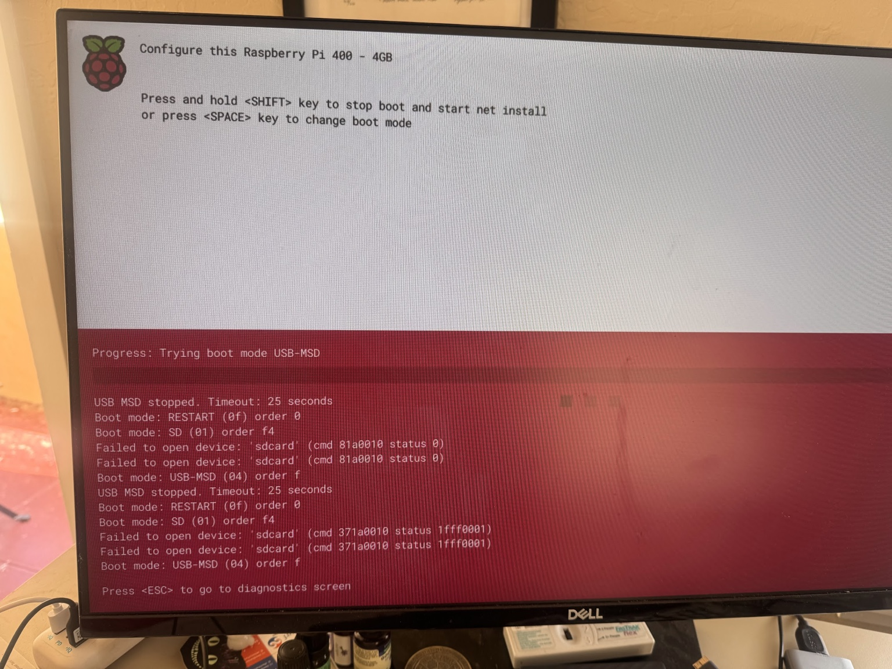
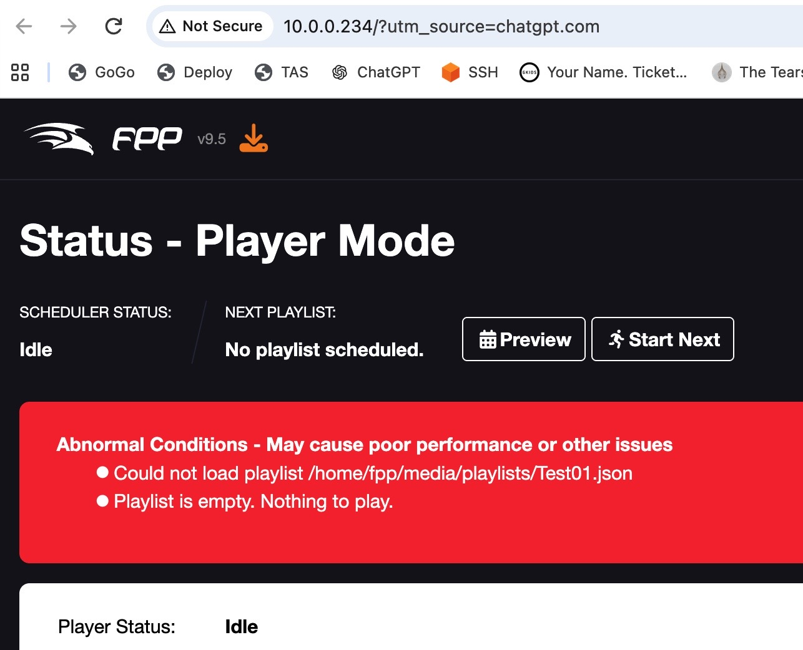
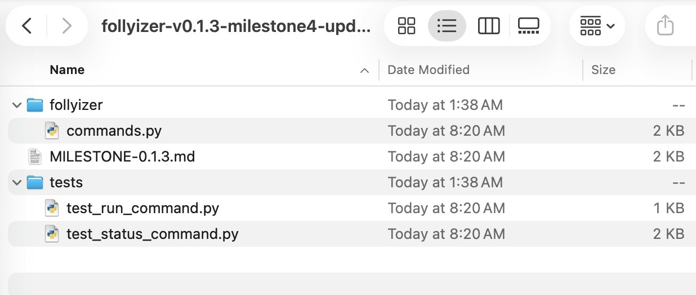

# Follyizer

**Meshtastic Remote Control and Monitoring for Falcon Player (FPP)**

[](https://thegothicfolly.com/)

**Feasibility project completed August 10, 2026 — remote FPP control over Meshtastic proven on real hardware.**

Follyizer is a lightweight bridge between **Meshtastic** and **Falcon Player (FPP)**. It lets an operator ask what a lighting installation is doing, start an FPP playlist, and stop playback over a long-range LoRa mesh without requiring Internet or cellular service at the installation.

Follyizer was created as a feasibility experiment for the [**Gothic Folly**](https://thegothicfolly.com/) at [**Burning Man 2026**](https://burningman.org/). Gothic Folly uses **xLights → Raspberry Pi / FPP → Falcon controllers → 23,000+ addressable LEDs**. The experiment asked a very practical question:

> **Can a remote operator use Meshtastic to control and monitor Falcon Player on the playa?**

The answer is **yes**.

---

## Principal Maintainer

**Frank Cohen**  
Creator and principal maintainer of Follyizer

---

# The Gothic Folly

The Gothic Folly is a monumental open-air cathedral built for Black Rock City 2026. At night its programmable LED system turns the structure into a canvas for synchronized light, music, performance, and gathering.

[](https://thegothicfolly.com/)

The production lighting stack is substantially larger than the Follyizer bench experiment:

```text
xLights sequences
      │
      ▼
Raspberry Pi running Falcon Player
      │
      ▼
Falcon pixel controller(s)
      │
      ▼
23,000+ addressable LEDs
```

Follyizer sits beside FPP. It does not modify xLights, FPP, or the Falcon controllers.

---

# What We Wanted to Prove

The original goal was deliberately narrow.

From a Meshtastic node some distance away, could an operator:

1. send a command over LoRa;
2. have a Raspberry Pi receive it;
3. translate it into an FPP action;
4. start or stop a real FPP playlist;
5. query the actual FPP playback state; and
6. receive that status back over the mesh?

The experiment did **not** need the Cathedral's LEDs or Falcon controllers. If Follyizer could reliably control the FPP layer, the downstream lighting system could remain exactly as the Gothic Folly team already designed it.

---

# Feasibility Bench

The San Francisco test bench used:

- **Raspberry Pi 400, 4 GB**
- **64 GB Samsung microSD**
- **Falcon Player 9.5**
- **Python 3.11**
- **Heltec V3 Meshtastic node** connected to the Pi over USB
- **Second Meshtastic node (SPL3)** as the remote operator
- Wi-Fi only for setup, SSH, GitHub, and viewing the FPP web interface
- no Falcon controller
- no LED pixels
- no Internet dependency in the actual Meshtastic control path

The Pi saw the Heltec as:

```text
/dev/ttyUSB0
```

with the USB device identified as a Silicon Labs CP210x UART bridge.

### The Pi 400 setup was itself part of the experiment

We flashed FPP directly to the microSD card and initially hit a Pi boot failure:



After resolving the SD-card/boot problem, FPP 9.5 ran successfully on the Pi 400.

The Pi joined the local Wi-Fi network at:

```text
10.0.0.234
```

which allowed the FPP web interface to be viewed from a Mac during development.

---

# Architecture Proven

```text
                Remote Operator
                 Meshtastic Node
                       │
                       │ LoRa mesh
                       ▼
                 Heltec V3
                       │
                       │ USB serial
                       ▼
              Raspberry Pi 400
        ┌─────────────────────────────┐
        │          Follyizer          │
        │                             │
        │  • persistent mesh link     │
        │  • FZ command parser        │
        │  • FPP HTTP client          │
        │  • status formatter         │
        └──────────────┬──────────────┘
                       │
                       │ localhost HTTP
                       ▼
               Falcon Player 9.5
                       │
             production system:
                       ▼
             Falcon controller(s)
                       │
                       ▼
              Gothic Folly LEDs
```

The important design choice is that **one Follyizer process owns the Meshtastic serial port**. Early experiments showed that two Python programs cannot simultaneously open `/dev/ttyUSB0`; the operating system correctly reports that the serial resource is busy.

The final feasibility architecture therefore uses one persistent Meshtastic connection for both receiving and transmitting.

---

# The Five Initial Experiments

Before building Follyizer itself, five tiny programs tested the individual links.

## 001 — Connect to Meshtastic

The first program opened `/dev/ttyUSB0` and queried the attached node.

Successful result included:

```text
Connected.

My Node Info
------------
id: !043a241c
hwModel: HELTEC_V3
```

**Proved:** Python on FPP could communicate with the Heltec over USB.

---

## 002 — Receive Meshtastic Text

The Pi listened while messages were sent from another node.

Example:

```text
Received Message
From : !be49a244
Port : TEXT_MESSAGE_APP
Text : Hi Sunday eve
```

**Proved:** Meshtastic → Heltec → USB → Python worked.

---

## 003 — Send Meshtastic Text

Python sent a message through the attached Heltec and it appeared on the other node.

**Proved:** Python → USB → Heltec → Meshtastic worked.

This experiment also exposed an important constraint: only one process can own `/dev/ttyUSB0` at a time.

---

## 004 — Status Transmission

The status experiment combined the radio link with a compact telemetry message.

This evolved into the `FZ STAT` response used by Follyizer.

---

## 005 — Query Falcon Player

The Pi queried:

```text
http://127.0.0.1/api/fppd/status
```

FPP 9.5 returned live JSON including:

```text
status_name
current_playlist
current_sequence
current_song
time_elapsed
time_remaining
volume
powerBad
CPU temperature
version
```

Example bench values:

```text
state=idle
playlist=-
elapsed=00:00
remaining=00:00
volume=70
temp=35.0
powerBad=False
version=9.5
```

**Proved:** Follyizer could observe the real state of FPP without modifying FPP.

---

# Building Follyizer One Milestone at a Time

After the five experiments succeeded, the pieces were combined incrementally.

## Milestone 1 — Persistent Meshtastic Connection

Follyizer opened `/dev/ttyUSB0` once and stayed connected.

A real received message looked like:

```text
2026-08-10 05:05:40 INFO __main__:
MESHTASTIC RX from=!be49a244 text='Good evening from Brisbane'
```

**Result: SUCCESS**

---

## Milestone 2 — FPP Status Integration

While keeping the Meshtastic connection open, Follyizer polled FPP every 10 seconds during development.

Example:

```text
FPP STATUS state=idle playlist=- elapsed=00:00 remaining=00:00
volume=70 temp=34.1 powerBad=False version=9.5
```

Meshtastic messages continued arriving while FPP was being monitored.

**Result: SUCCESS**

---

## Milestone 3 — `FZ STATUS`

The first complete request/response transaction was:

```text
FZ STATUS Q=1
```

Follyizer queried FPP and sent a **direct Meshtastic reply to the requesting node**:

```text
FZ STAT S=- P=IDLE T=00:00/00:00 V=70 C=35 PWR=OK Q=1
```

The Pi log confirmed the transmission:

```text
MESHTASTIC TX to=!be49a244
text='FZ STAT S=- P=IDLE T=00:00/00:00 V=70 C=35 PWR=OK Q=1'
```

**Result: SUCCESS**

---

## Milestone 4 — `FZ RUN`

The next command started an FPP playlist by name:

```text
Fz run Test01 q=2
```

Protocol words are case-insensitive. The playlist name is preserved exactly as typed.

Follyizer logged:

```text
MESHTASTIC RX from=!be49a244 text='Fz run Test01 q=2'
FPP RUN playlist=Test01 requested_by=!be49a244
MESHTASTIC TX to=!be49a244 text='FZ ACK Q=2 RUN Test01'
```

An early test usefully demonstrated that the entire command path was working even before a valid playlist existed. FPP displayed:



That told us Follyizer had successfully delivered `Test01` all the way to FPP; FPP simply had nothing to play yet.

We then created a real `Test01` playlist containing a **60-second Pause**. This was ideal for the bench test because it required no speakers, LEDs, or Falcon controller.

Sending:

```text
Fz run Test01 q=4
```

produced:

```text
FZ ACK Q=4 RUN Test01
```

and FPP reported:

```text
state=playing
playlist=Test01
elapsed=00:08
remaining=00:51
```

A subsequent `FZ STATUS` returned the live playing state over Meshtastic.

**Result: SUCCESS**

---

## Milestone 5 — `FZ STOP`

While `Test01` was running, the remote node sent:

```text
Fz stop q=5
```

Follyizer logged:

```text
MESHTASTIC RX from=!be49a244 text='Fz stop q=5'
FPP STOP requested_by=!be49a244
MESHTASTIC TX to=!be49a244 text='FZ ACK Q=5 STOP'
```

Seven seconds later the FPP status poll showed:

```text
FPP STATUS state=idle playlist=- elapsed=00:00 remaining=00:00
```

**Result: SUCCESS**

This completed the remote **start → observe → stop → observe** loop.

---

# Command Protocol

The feasibility project intentionally kept the radio protocol simple enough to type manually from a Meshtastic phone interface.

## Status

```text
FZ STATUS Q=1
```

Example response:

```text
FZ STAT S=- P=IDLE T=00:00/00:00 V=70 C=35 PWR=OK Q=1
```

## Run a playlist

```text
FZ RUN Test01 Q=2
```

Response:

```text
FZ ACK Q=2 RUN Test01
```

## Stop playback

```text
FZ STOP Q=3
```

Response:

```text
FZ ACK Q=3 STOP
```

## Case handling

Protocol keywords are case-insensitive:

```text
FZ RUN Test01 Q=2
fz run Test01 q=2
Fz Run Test01 Q=2
```

all mean the same thing.

Playlist names are **not normalized**. `Test01` is passed to FPP as `Test01`.

## Sequence number

`Q=` is a small transaction/sequence identifier chosen by the sender. Follyizer includes it in the response so the operator can associate a reply with a request.

---


# Access Control

Follyizer controls a real lighting system, so `FZ` commands should not be accepted indiscriminately from every Meshtastic channel or node.

Follyizer uses two layers of access control:

1. **A dedicated Meshtastic control channel**
2. **An optional sender allowlist**

## Dedicated control channel

Follyizer only executes `FZ` commands received on the Meshtastic channel configured by `meshtastic.channel_index`.

A recommended arrangement for the Gothic Folly is:

```text
Channel 0 — Public/default Meshtastic traffic
Channel 1 — Private Follyizer control channel
```

Configure Follyizer for the private control channel:

```yaml
meshtastic:
  serial_device: /dev/ttyUSB0
  channel_index: 1
```

An `FZ RUN`, `FZ STOP`, or `FZ STATUS` command received on another channel is ignored.

The private control channel should use a Meshtastic PSK known only to authorized operators. **The PSK is not stored in Follyizer or `config.yaml`.** Channel encryption and PSK provisioning remain on the Meshtastic nodes; Follyizer stores only the non-secret channel index.

## Optional sender allowlist

Follyizer can additionally restrict commands to specific Meshtastic node IDs:

```yaml
meshtastic:
  serial_device: /dev/ttyUSB0
  channel_index: 1
  authorized_senders:
    - "!be49a244"
    - "!12345678"
```

When `authorized_senders` contains node IDs, commands from other nodes are ignored. When the list is empty, any sender on the configured control channel may issue Follyizer commands.

The allowlist is **defense-in-depth, not cryptographic authentication**. Meshtastic node IDs can be spoofed or self-asserted. The private channel PSK remains the primary access-control boundary.

## Command decision

```text
Meshtastic message
        │
        ▼
Is it an FZ command?
        │
        ▼
Is it on the configured
control channel?
        │
     NO ├──────────► Ignore
        │ YES
        ▼
Is authorized_senders
configured?
        │
   NO   ├──────────► Execute
        │ YES
        ▼
Is sender on allowlist?
        │
     NO ├──────────► Ignore
        │ YES
        ▼
Execute FZ command
        │
        ▼
Falcon Player
```

These checks happen before an `FZ` command is executed against Falcon Player.

---

# What `FZ STAT` Means

Example:

```text
FZ STAT S=Test01 P=PLAYING T=00:18/00:41 V=70 C=35 PWR=OK Q=6
```

| Field | Meaning |
|---|---|
| `S=` | FPP playlist/show |
| `P=` | playback state |
| `T=` | elapsed / remaining |
| `V=` | FPP volume |
| `C=` | Raspberry Pi CPU temperature °C |
| `PWR=` | FPP power warning state |
| `Q=` | request sequence number |

The status is generated from the live FPP API, not from Follyizer's assumptions about what should be running.

---

# Why There Is No Automatic Two-Minute Broadcast

The original concept called for broadcasting status every two minutes.

The feasibility work changed that decision.

Meshtastic is a shared, low-bandwidth LoRa network. An installation that transmits status forever whether anyone needs it or not consumes mesh airtime and can contribute to congestion—particularly at an event with many nodes.

For the feasibility version, Follyizer therefore uses **status on demand**:

```text
FZ STATUS Q=<n>
```

This is quieter, simpler, and more respectful of the mesh.

Future deployment work could consider low-frequency heartbeats or event-driven alerts if the Gothic Folly operations team finds a concrete need for them.

---

# What We Deliberately Did Not Build

This was a feasibility project, not a production control system.

The experiment does **not** currently require:

- a web dashboard;
- MQTT;
- a playlist translation/alias file;
- automatic two-minute status broadcasts;
- a queue;
- a scheduler;
- remote software updates;
- a Falcon controller on the bench;
- actual LED pixels on the bench;
- arbitrary shell-command execution;
- a complicated command-processing framework.

`BLACKOUT` was discussed but was not required to prove feasibility. `STOP` already provides the essential remote stop capability for this experiment.

The philosophy was simple:

> **Prove the smallest useful end-to-end system on the real FPP/Meshtastic hardware.**

---

# Feasibility Result

## SUCCESS

On August 10, 2026, the bench system demonstrated:

```text
Remote Meshtastic node
        │
        │ FZ RUN Test01
        ▼
     LoRa mesh
        ▼
     Heltec V3
        ▼
   Raspberry Pi 400
        ▼
      Follyizer
        ▼
  Falcon Player 9.5
        ▼
 Test01 PLAYING
        │
        │ live FPP status
        ▼
      Follyizer
        ▼
     LoRa mesh
        ▼
Remote operator sees PLAYING
        │
        │ FZ STOP
        ▼
  Falcon Player returns IDLE
```

The critical test log was:

```text
MESHTASTIC RX from=!be49a244 text='Fz run Test01 q=4'
FPP RUN playlist=Test01 requested_by=!be49a244
MESHTASTIC TX to=!be49a244 text='FZ ACK Q=4 RUN Test01'

FPP STATUS state=playing playlist=Test01
elapsed=00:08 remaining=00:51 volume=70 temp=34.1
powerBad=False version=9.5

MESHTASTIC RX from=!be49a244 text='Fz stop q=5'
FPP STOP requested_by=!be49a244
MESHTASTIC TX to=!be49a244 text='FZ ACK Q=5 STOP'

FPP STATUS state=idle playlist=- elapsed=00:00 remaining=00:00
volume=70 temp=34.6 powerBad=False version=9.5
```

That is the feasibility project in one transcript.

---

# What Still Needs to Happen Before Playa Deployment

The **technical concept is proven**. Production hardening is a separate task.

Recommended next steps are:

1. Run Follyizer automatically at Pi boot using `systemd`.
2. Verify recovery after a full Pi power cycle.
3. Verify behavior if the Heltec is unplugged and reconnected.
4. Verify behavior if FPP temporarily restarts or becomes unavailable.
5. Test with the Gothic Folly team's actual Raspberry Pi/FPP configuration.
6. Test with a real xLights/FPP sequence.
7. Test through the real Falcon controller and LED system.
8. Configure and test a private Follyizer Meshtastic control channel.
9. Populate `authorized_senders` if the deployment will use the optional node allowlist.
10. Verify that `FZ` commands sent on the public/default channel are ignored.
11. If the allowlist is enabled, verify that commands from a non-allowlisted node are ignored.
12. Decide operationally whether `BLACKOUT` should be distinct from `STOP`.
13. Perform a real-world Meshtastic range/reliability test before deployment.

These are deployment and reliability tests. They do not change the feasibility conclusion.

---

# Installation

On FPP/Raspberry Pi:

```bash
git clone https://github.com/frankcohen/follyizer.git
cd follyizer
```

Create the Python virtual environment:

```bash
python3 -m venv .venv
source .venv/bin/activate
```

Install dependencies:

```bash
pip install -r requirements.txt
```

Create the local configuration:

```bash
cp config.example.yaml config.yaml
vi config.yaml
```

For the feasibility Pi, the Meshtastic serial device was:

```yaml
meshtastic:
  serial_device: /dev/ttyUSB0
```

Run Follyizer interactively:

```bash
python -m follyizer.app --config config.yaml
```

A healthy startup looks approximately like:

```text
Connecting to Meshtastic node at /dev/ttyUSB0
Meshtastic serial connection established
Follyizer connected: node=!043a241c hardware=HELTEC_V3
Listening for Meshtastic text. Press Ctrl-C to stop.
```

---

# Development Workflow Used

The project was developed remotely:

```text
Mac / GitHub
     │
     │ git push / git pull
     ▼
Raspberry Pi 400
     │
     ├── FPP 9.5
     ├── Follyizer
     └── Heltec V3
```

Typical Pi workflow:

```bash
ssh fpp@<pi-address>

cd ~/follyizer
git pull
source .venv/bin/activate
python -m follyizer.app --config config.yaml
```

During development we also learned to verify the code actually running on the Pi:

```bash
git log -1 --oneline
grep -n "_handle_run" follyizer/app.py
python -c "import follyizer.app; print(follyizer.app.__file__)"
```

This caught a packaging mistake where an earlier ZIP omitted `app.py` and `fpp_client.py`:



That episode is not part of the Follyizer runtime design, but it was a useful reminder to verify deployment artifacts rather than assuming a successful `git pull` means the intended code was committed.

---

# Repository Layout

```text
follyizer/
├── follyizer/
│   ├── app.py
│   ├── commands.py
│   ├── config.py
│   ├── fpp_client.py
│   └── meshtastic_link.py
│
├── experiments/
│   ├── 001_connect.py
│   ├── 002_receive.py
│   ├── 003_send.py
│   ├── 004_status.py
│   └── 005_fpp.py
│
├── tests/
├── follyizer.service
├── config.example.yaml
├── requirements.txt
└── README.md
```

---

# A Note About Audio

The original experiment also considered synchronized audio.

The Gothic Folly production system can use the Raspberry Pi/FPP audio path independently of Follyizer. During early planning we considered:

```text
Pi → HDMI → monitor speakers
```

and the Gothic Folly team uses a USB audio adapter with a Pi 4.

The actual Follyizer feasibility test did **not** require audio. The 60-second FPP Pause playlist was enough to prove remote playlist control and playback-state monitoring.

Audio synchronization remains FPP's responsibility; Follyizer only tells FPP what to run.

---

# Project Status

**Feasibility: proven.**

As of August 17, 2026:

- Persistent Meshtastic connection — **working**
- Receive remote commands — **working**
- Direct Meshtastic replies — **working**
- Query FPP 9.5 status — **working**
- `FZ STATUS` — **working**
- `FZ RUN` — **working**
- `FZ STOP` — **working**
- Case-insensitive command entry — **working**
- Real FPP playback state returned over mesh — **working**
- Dedicated Meshtastic control-channel enforcement — **implemented**
- Optional authorized-sender allowlist — **implemented**
- Meshtastic PSK kept outside Follyizer/Git — **by design**
- Automatic status broadcast — **intentionally not used**
- Production hardening — **next phase**
- Playa deployment — **not yet tested**

---

# Acknowledgements

Follyizer exists because of the open-source work behind:

- [Meshtastic](https://meshtastic.org/)
- [Falcon Player](https://github.com/FalconChristmas/fpp)
- [xLights](https://xlights.org/)
- Raspberry Pi

The project also acknowledges the support and community around:

- [The Gothic Folly](https://thegothicfolly.com/)
- [Burners Without Borders](https://burnerswithoutborders.org/)
- [Burning Mesh](https://www.burningmesh.org/)
- [Burning Man](https://burningman.org/)

---

# Contributing

Contributions, deployment experience, bug reports, and field-test results are welcome.

The most useful contributions now are likely to be around **reliability on real installations**: boot behavior, radio reconnection, FPP restart handling, logging, authorization, and playa-scale Meshtastic testing.

Special thanks to **ayysasha** for Follyizer's first external pull request, which added control-channel enforcement and optional sender authorization for safer deployment.

---

# License

GPL version 3
